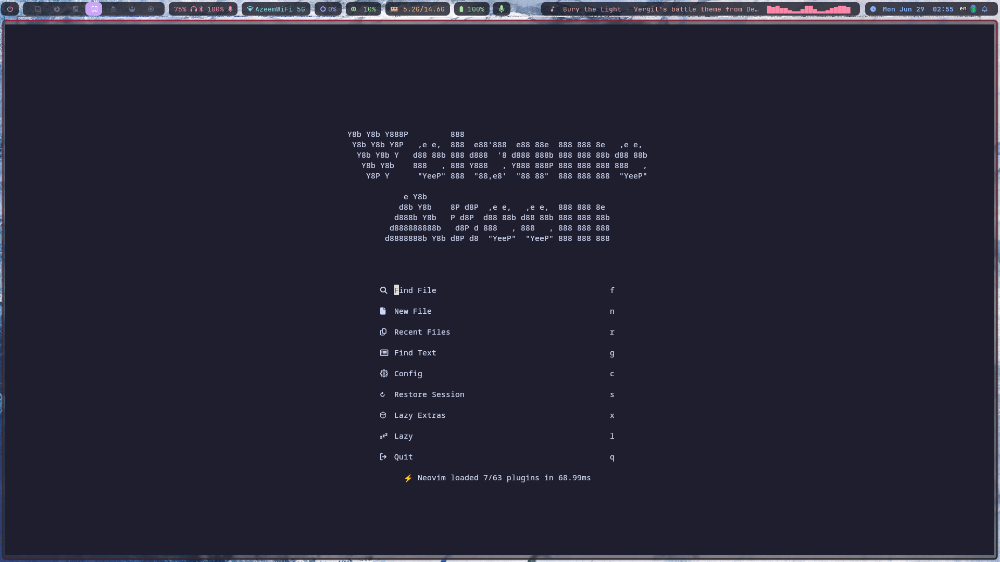
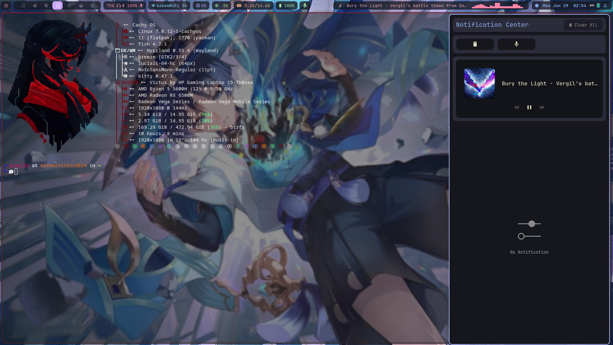
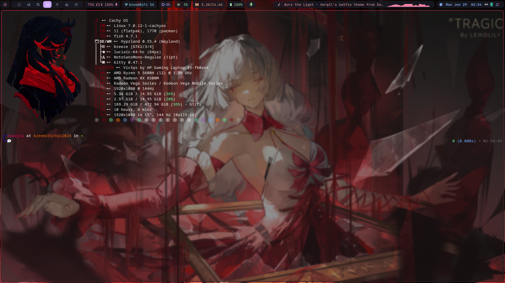
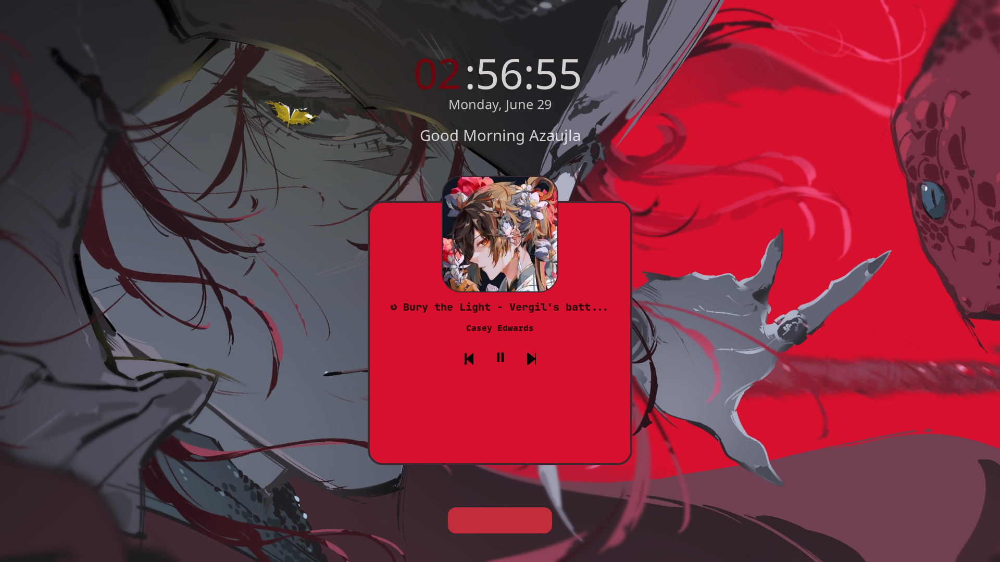

# Az Aujla's CachyOS dotfiles

## Credits / Sources

I used/modified the following for my setup

- [LazyVim/starter](https://github.com/LazyVim/starter) -- Noevim Configuration Starter Kit
- [Aditya Shakya/rofi](https://github.com/adi1090x/rofi) -- Rofi Menu Themes
- [OhMyFish](https://github.com/oh-my-fish/oh-my-fish) -- Fish Shell themes
- [Omar Mahmoud/dotfiles](https://github.com/OmarKrypton/dotfiles) -- Waybar Cava Setup + Fastfetch Config
- [Mahaveer Gurjar/Hyprlock-Dots](https://github.com/mahaveergurjar/Hyprlock-Dots) -- Hyprlock Lock Screen Config
- [voidptrx/dotfiles](https://github.com/voidptrx/dotfiles) -- Sway Notification Center
- [Yuki❄雪希 - Lucia: Inverse Crown | Cursors](https://x.com/yukichung96/status/2066148495145554058)

## Screenshots

